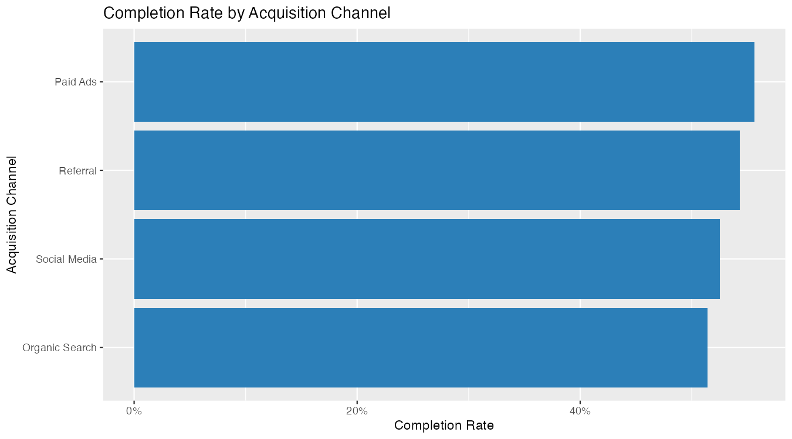
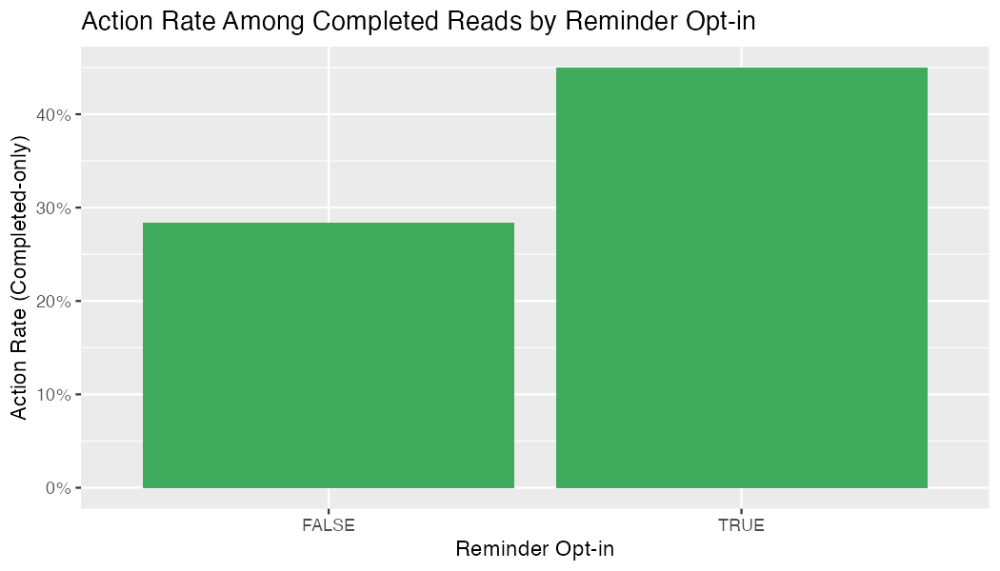
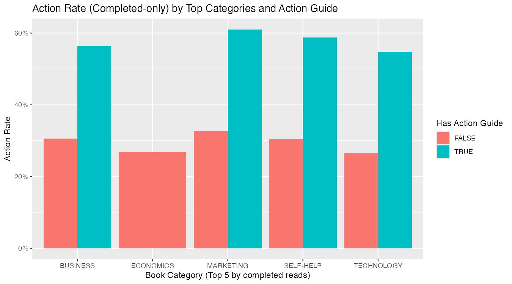

# Case Study — Book Execution Framework (Reading → Action)

This case study is structured using the **Google Data Analytics** framework:
**Ask → Prepare → Process → Analyze → Share → Act**

---

## Ask

**Business problem**  
Readers often finish books but fail to translate insights into action. This project explores which factors are associated with converting reading into verified action.

**Key questions**

1. What is the completion rate of reading logs?
2. What is the action rate among completed reads?
3. Is reminder opt-in associated with higher action rate?
4. Which segments (channel, tier, occupation) show higher completion/action rates?
5. Do book attributes (category, difficulty, action guide) correlate with action?

**Primary success metric**

- **Action rate (completed-only)** = % of completed reads where `action_performed = TRUE`

---

## Prepare

**Data sources (dummy dataset prepared for analysis)**

- `data/fact_reading_logs.csv`
- `data/dim_book_metadata.csv`
- `data/dim_user_profiles.csv`

**Where the data lives (BigQuery Sandbox)**

- Project: `refined-iridium-478011-r3`
- Dataset: `book_exec_capstone`
- Tables (created via BigQuery Console UI → Create table → Upload CSV → Auto-detect):
  - `refined-iridium-478011-r3.book_exec_capstone.fact_reading_logs`
  - `refined-iridium-478011-r3.book_exec_capstone.dim_book_metadata`
  - `refined-iridium-478011-r3.book_exec_capstone.dim_user_profiles`

**Setup documentation**

- SQL setup notes: `sql/00_setup_notes.sql`

---

## Process

### Data quality checks (report-ready metrics)

Source: `sql/01_data_quality_checks.sql`

| metric_name                                           |                          metric_value |
| ----------------------------------------------------- | -----------------------------------: |
| fact_reading_logs.total_rows                          |                                 3000 |
| fact_reading_logs.missing_user_id_rows                |                                   10 |
| fact_reading_logs.missing_user_id_rate                | 0.0033333333333333335 (**~0.33%**)   |
| dim_book_metadata.total_books                         |                                   40 |
| dim_book_metadata.negative_page_count_rows            |                                    2 |
| fact_reading_logs.null_start_date                     |                                    0 |
| fact_reading_logs.null_completion_date                |                                 1395 |
| fact_reading_logs.null_action_verification_date       |                                 2406 |
| fact_reading_logs.completion_before_start_rows        |                                    5 |
| fact_reading_logs.verification_before_completion_rows |                                    0 |

**Notes**

- `missing_user_id_rate` is low (~0.33%), so segmentation analyses are mostly unaffected.
- `completion_before_start_rows = 5` indicates a small number of inconsistent date rows.
  - Recommendation: exclude these rows from **date-delta analyses** (e.g., start→completion duration).
- `null_completion_date` is expected for non-completed reads.
- `null_action_verification_date` is expected when actions were not performed and/or not verified.

### Category value distribution (raw, pre-standardization)

Raw categories observed (before mapping in `sql/02_clean_views.sql`):

- Economics (12), Technology (8), Marketing (7), Self-Help (7), Business (4), BUSINESS (1), Biz (1)

After cleaning, these are normalized (e.g., Business/BUSINESS/Biz → BUSINESS).

### Cleaning / standardization logic implemented in views

Run: `sql/02_clean_views.sql`

---

## Analyze

### Overall KPIs (from BigQuery SQL)

Source: `sql/03_kpi_queries.sql` (Section A)

| metric_name                    |                               metric_value | notes                                       |
| ------------------------------ | -----------------------------------------: | ------------------------------------------- |
| kpi.total_reads                |                                       3000 | All rows in v_fact_reading_logs             |
| kpi.completed_reads            |                                       1605 | Rows where is_completed=TRUE                |
| kpi.completion_rate            |                          0.535 (**53.5%**) | completed_reads / total_reads               |
| kpi.completed_with_action      |                                        594 | is_completed=TRUE AND action_performed=TRUE |
| kpi.action_rate_completed_only | 0.37009345794392523 (**~37.0%**)           | completed_with_action / completed_reads     |

### Key breakdowns (evidence)

- Reminder opt-in vs action rate (completed-only): **45.0% (opt-in=true)** vs **28.4% (opt-in=false)**
- Time-to-verification: average **6.16 days**, quantiles **[1, 2, 4, 7, 10, 32]**

---

## Share

### Exported charts (from `analysis/01_eda_and_kpis.Rmd`)

After knitting/running the Rmd, commit the exported PNGs:

- Completion rate by channel  
  

- Action rate by reminder opt-in (completed-only)  
  

- (Optional) Action rate by category & action guide  
  

### Findings (summary)

1. Overall completion rate was **53.5%** (1605/3000).
2. Among completed reads, action rate was **~37.0%** (594/1605).
3. Reminder opt-in users had a higher completed-only action rate (**45.0%**) than non-opt-in users (**28.4%**); this is an association, not causation.
4. Verified actions were typically confirmed within **~1–10 days**, with an average of **~6.16 days**.

---

## Act

**Recommendations (based on observed associations)**

1. **Improve reminder opt-in funnel:** opt-in users show higher action rate (~45% vs ~28%). Consider UX nudges to increase opt-in.
2. **Optimize follow-ups in the 1–10 day window:** use post-completion nudges to encourage verification while users are most likely to act.
3. **Action-guide content strategy:** validate whether `has_action_guide=TRUE` consistently improves action rates and prioritize that content type.

> Note: This is a dummy dataset used to demonstrate an end-to-end analytics workflow aligned with the Google Data Analytics (Ask–Prepare–Process–Analyze–Share–Act) framework.